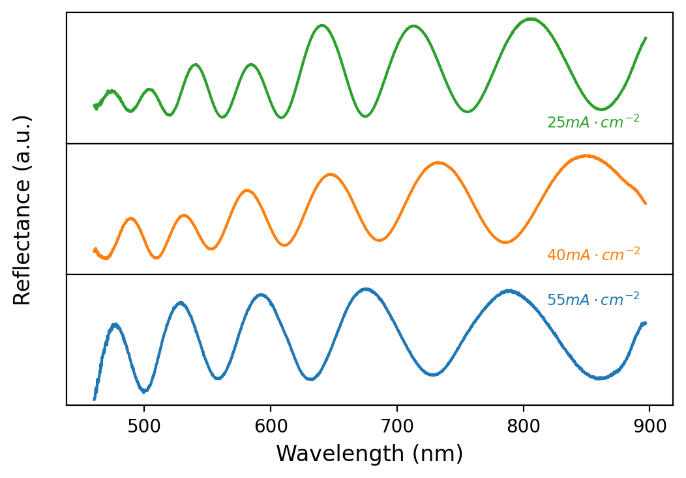
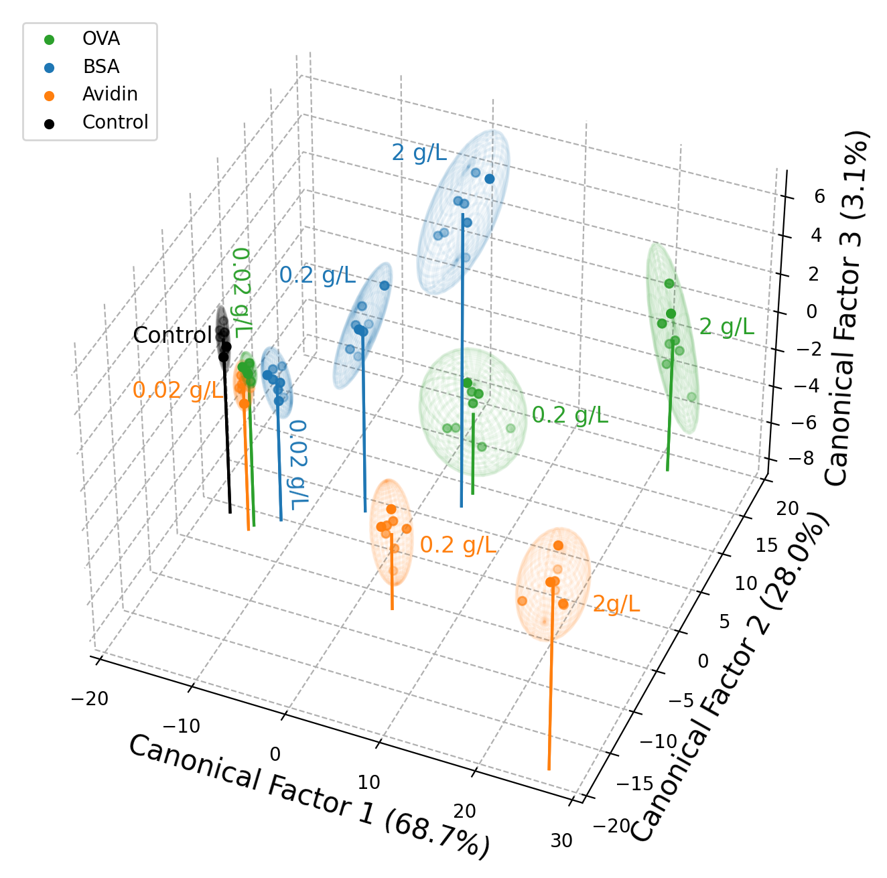

&emsp;&emsp;&emsp;&emsp;&emsp;&emsp;&emsp;
# Capture Agent Free Biosensing

***
For full details, see the following publications:

Ward, S. J., Cao, T., Zhou, X., Chang, C., & Weiss, S. M. (2023). Protein Identification and Quantification Using Porous Silicon Arrays, Optical Measurements, and Machine Learning. _biosensors_ __13__(9), 879, 1–12. doi: [10.3390/bios13090879](https://doi.org/10.3390/bios13090879)

Ward, S. J., Cao, T., Chang, C., & Weiss, S. M. (2022). Analysis of machine learning techniques for capture agent free biosensing with porous silicon arrays. _Proc. SPIE_, __11979__(1197907). doi: [10.1117/12.2614697](https://doi.org/10.1117/12.2614697)

***
## Table of Contents
### 1. Motivation
### 2. Experimental Data
#### 2.1 Porous Silicon
#### 2.2 Data Collection
### 3. Data Visualization
#### 3.1 Full Dataset
#### 3.2 Dimensionality Reduced Dataset
#### 3.3 Linear Discriminant Analysis Weightings
### 4. Model Training & Evaluation
### 5. FAQs
### 6. Acknowledgements
***
## 1. Motivation

Biosensors are an essential tool for medical diagnostics, environmental monitoring and food safety. Typically, biosensors are designed to detect harmful biological molecules (biomolecules) with the appropriate capture agents (receptor molecules that specifically bind with the target biomolecule). However, the use of capture agents limits the number of biomolecules that can be simultaneously detected and reduces the robustness of the biosensor to extreme climates (which often coincide with geographic regions which are low income and highly impacted by infectious disease).

&emsp;&emsp;&emsp;&emsp;&emsp;&emsp;&emsp;&emsp;&emsp;&emsp; 

In this work, we report a versatile, capture agent free biosensor platform based on an array of porous silicon (PSi) thin films, which has the potential to robustly detect a wide variety of biomolecules based on their physical and chemical properties in the nanoscale porous media. The ability of this system to reproducibly classify, quantify, and discriminate three proteins separately is demonstrated to concentrations down to at least 0.02mg/Lm (between 300nM and 450nM) by utilizing PSi array elements with a unique combination of pore size and buffer pH, along with machine learning analysis. Linear discriminant analysis is employed for dimensionality reduction and support vector machines are used as a classifier. This work represents a significant first step towards a low cost, simple and robust biosensor platform that is able to detect a vast range of biomolecules.

&emsp;&emsp;&emsp;&emsp;&emsp;&emsp;&emsp; 

***
## 2. Experimental Data
### 2.1 Porous Silicon
Porous Silicon (PSi) is silicon with nanostructured pores, which have been electrochemically etched using hydrofluoric acid. Below are shown some images on the scale of a few nanometres taken using an electron microscope, and and illustration of how molecules are captured and detected optically in the pores.

### 2.2 Data Collection
Porous silicon sensors were electrochemically etched at a current density of either 55 mA cm-2, 40 mA cm-2, or 25 mA cm-2, to form thin films with different pore size distributions for the different elements in the sensing array, and diced into 5mm x 5mm squares.

The sensor was used to identify and quantify three different proteins: chicken ovalbumin (OVA), bovine seruma albumin (BSA), and avidin, each with a unique combination of molecule size and isoelectric point, which both determine how readily they are captured in the pores, prepared in solutions using either pH4 or pH10 buffers.

&emsp;&emsp;&emsp;&emsp;&emsp;&emsp;&emsp;&emsp;&emsp;&emsp;&emsp;&emsp;&emsp; 

***
### 3. Data Visualization
#### 3.1 Underlying Optical Spectra
Respresentative optical spectra of porous silicon fabricated with each of the three pore sizes used in this work are shown in this [notebook](Python/RawSpectraPlotPanes.ipynb).

***
#### 3.1 Full Dataset
The full experimental dataset
***
#### 3.2 Dimensionality Reduced Dataset
The dimensionality of the original 6 dimensional dataset is reduced using linear disrminant analysis (LDA) and is shown in this [notebook](Python/LDA_3DPlot_PairwiseAveraging.ipynb).

***
#### 3.3 Linear Discriminant Analysis Weightings

***
### 4. Model Training & Evaluation

A broad selection of machine learning models were applied in this [notebook]()
***
## 5. FAQs

***
## 6. Acknowledgements

***
