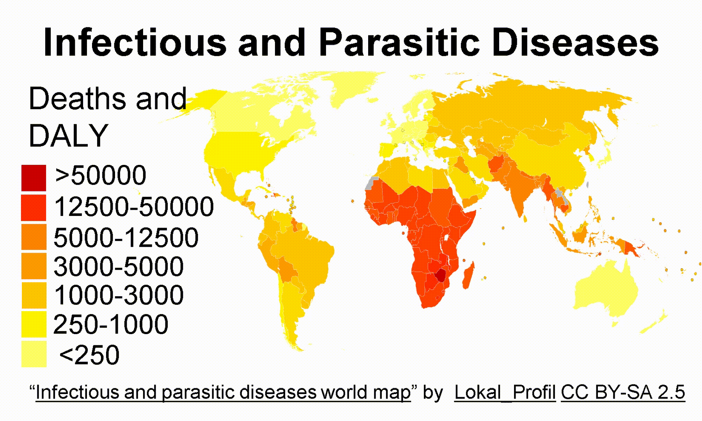

&emsp;&emsp;&emsp;&emsp;&emsp;&emsp;&emsp;
# Capture Agent Free Biosensing

***
For full details, see the following publications:

Ward, S. J., Cao, T., Zhou, X., Chang, C., & Weiss, S. M. (2023). Protein Identification and Quantification Using Porous Silicon Arrays, Optical Measurements, and Machine Learning. _biosensors_ __13__(9), 879, 1–12. doi: [10.3390/bios13090879](https://doi.org/10.3390/bios13090879)

Ward, S. J., Cao, T., Chang, C., & Weiss, S. M. (2022). Analysis of machine learning techniques for capture agent free biosensing with porous silicon arrays. _Proc. SPIE_, __11979__(1197907). doi: [10.1117/12.2614697](https://doi.org/10.1117/12.2614697)

***
## Table of Contents
### 1. Motivation
### 2. Experimental Data
#### 2.1 Porous Silicon
#### 2.2 Data Collection
### 3. Data Visualization
#### 3.1 Full Dataset
#### 3.2 Dimensionality Reduced Dataset
#### 3.3 Linear Discriminant Analysis Weightings
### 4. Model Training & Evaluation
### 5. FAQs
### 6. Acknowledgements
***
## 1. Motivation

Using machine learning applied to data from multiple cross-reactive biosensors to enable cheaper medical diagnostic tests which can better withstand harsh environments, a step towards improved worldwide healthcare access

&emsp;&emsp;&emsp;&emsp;&emsp;&emsp;&emsp;&emsp;&emsp;&emsp; 

&emsp;&emsp;&emsp;&emsp;&emsp;&emsp;&emsp; 

***
## 2. Experimental Data
### 2.1 Porous Silicon
Porous Silicon (PSi) is silicon with nanostructured pores, which have been electrochemically etched using hydrofluoric acid. Below are shown some images on the scale of a few nanometres taken using an electron microscope, and and illustration of how molecules are captured and detected optically in the pores.

### 2.2 Data Collection
Porous silicon sensors were electrochemically etched at a current density of either 55 mA cm−2, 40 mA cm−2, or 25 mA cm−2, to form thin films with different pore size distributions for the different elements in the sensing array, and diced into 5mm x 5mm squares.

The sensor was used to identify and quantify three different proteins: chicken ovalbumin (OVA), bovine seruma albumin (BSA), and avidin, each with a unique combination of molecule size and isoelectric point, which both determine how readily they are captured in the pores, prepared in solutions using either pH4 or pH10 buffers.

&emsp;&emsp;&emsp;&emsp;&emsp;&emsp;&emsp;&emsp;&emsp;&emsp;&emsp;&emsp;&emsp; 

***
### 3 Data Visualization
#### 3.1 Full Dataset
The full experimental dataset
***
#### 3.2 Dimensionality Reduced Dataset

***
#### 3.3 Linear Discriminant Analysis Weightings

***
### 4 Model Training & Evaluation

A broad selection of machine learning models were applied in this [notebook]()
***
## 5. FAQs

***
## 6. Acknowledgements

***
